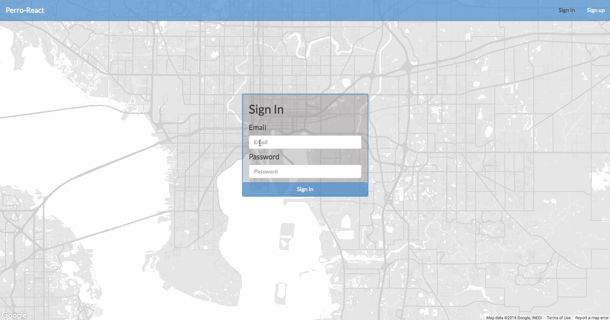

#Perro-react#

This a personal project I started to experiment with React, Redux, Node, Express and MongoDB.

To get started, I used Stephen Grider's excellent React/Redux boilerplate.  You can find the repository [here](https://github.com/StephenGrider/ReduxSimpleStarter).

If you're interested in learning React/Redux, I highly recommend Stephen Grider's courses on [Udemy](https://www.udemy.com/react-redux/).

###Getting Started###

```
- clone repo
- cd into project directory
- npm install (repeat for server directory)
- npm start (repeat for server directory)
```

**Please note, the app is currently setup to run using a locally hosted database. If you clone and install the repo, it will not function.**

###See it in action###


###What does the app do?###
The app provides a platform to log and track activities for pets (namely dogs).

###Future Plans###

```
-Integrate the Fitbit API to allow users to exercise events and assign them to a dog.
-Allow multiple users to share an account.
-Create goals and requirements--e.g. My goal is to walk the dogs 60 minutes per day.
```
